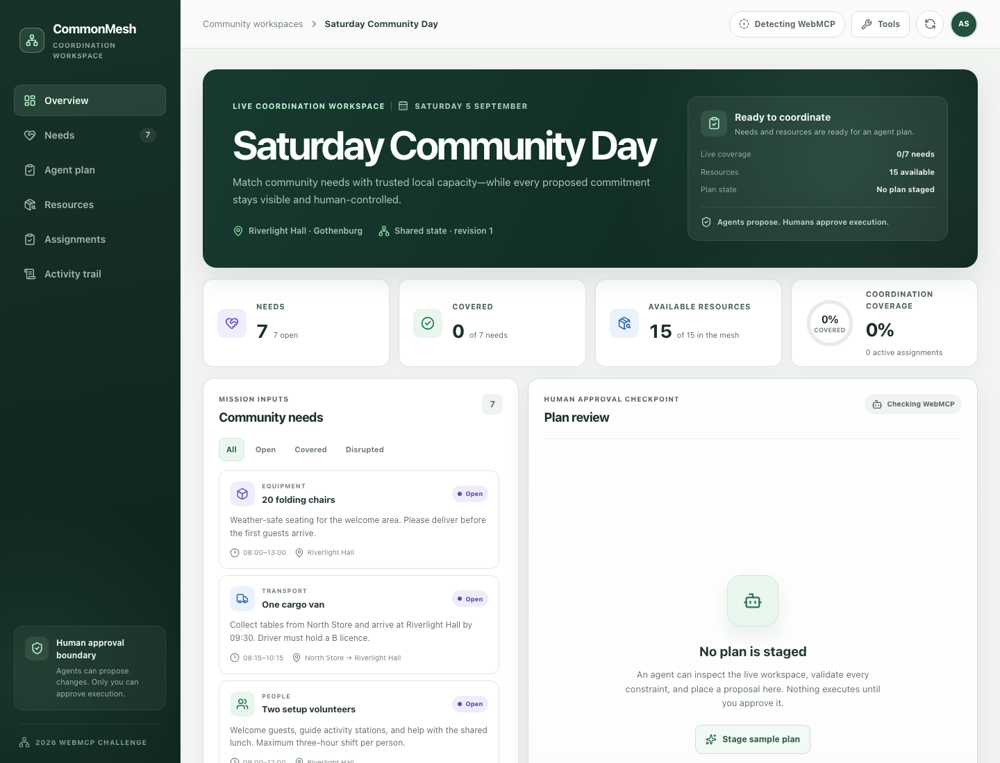
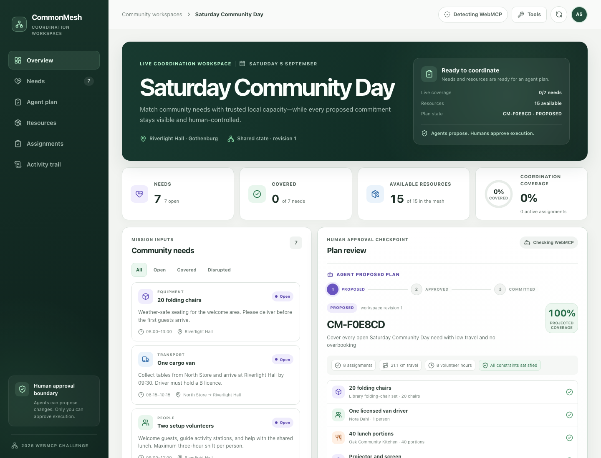
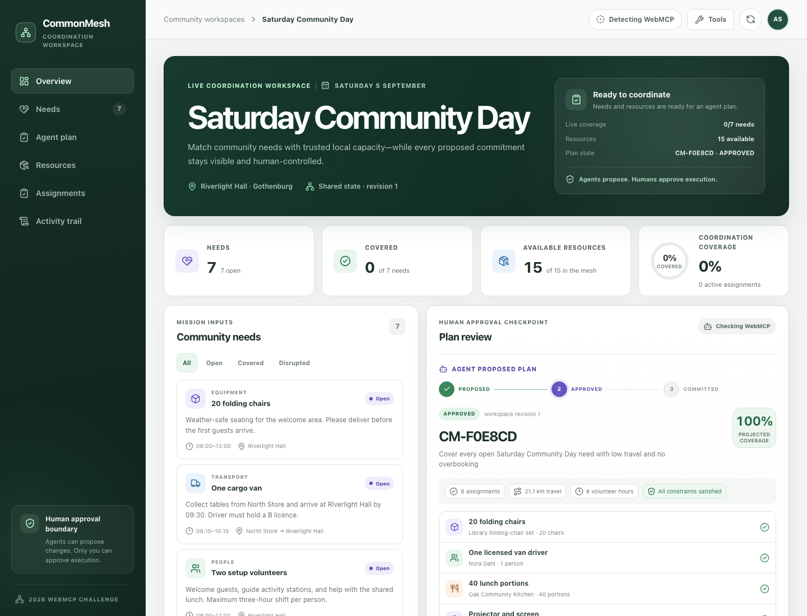
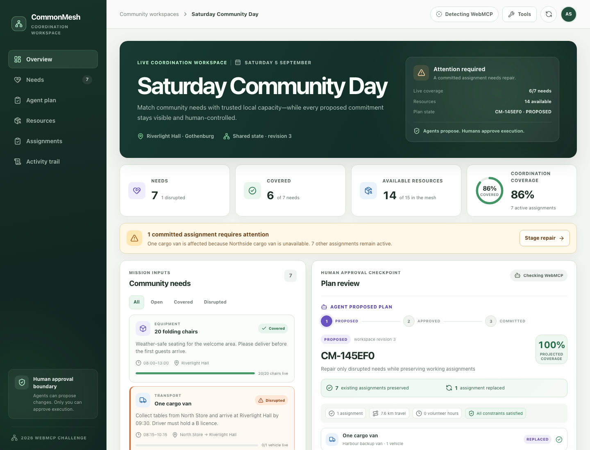
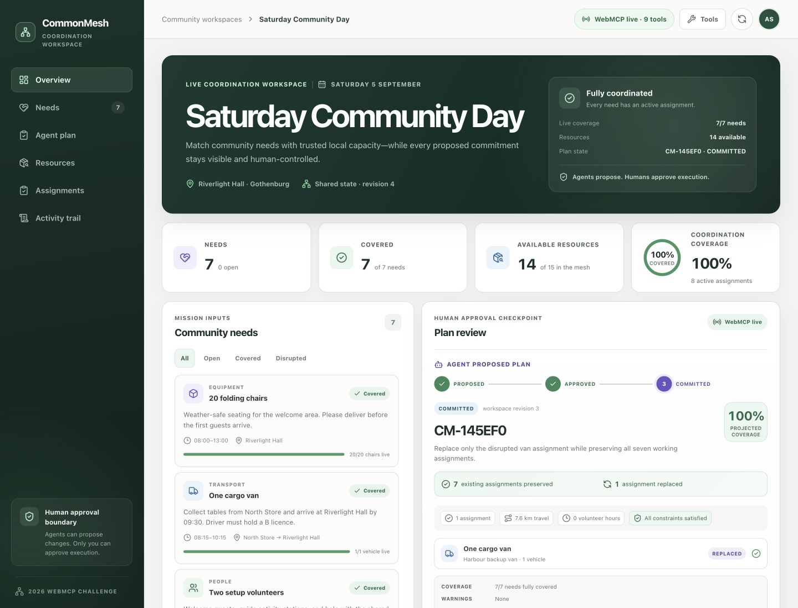
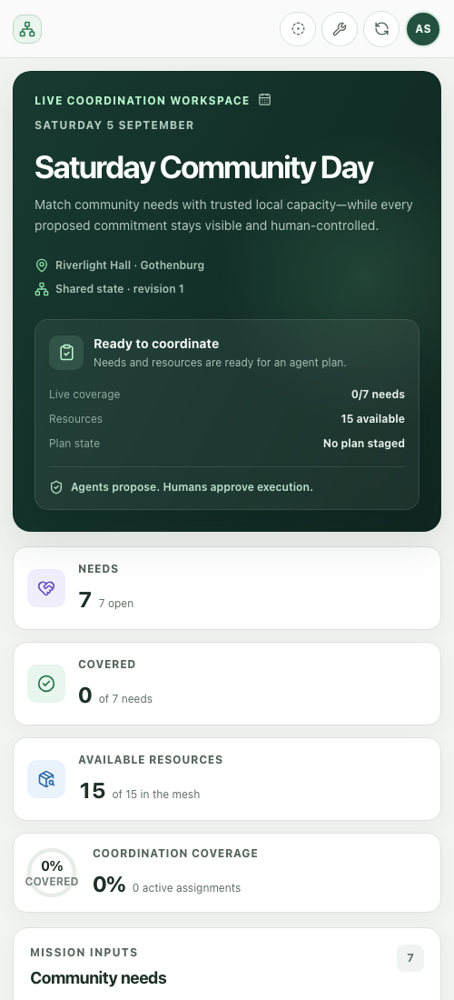

# CommonMesh

CommonMesh turns complex community coordination into a transparent, human-approved agent workflow.

**Built for the 2026 WebMCP Challenge.**

[](https://github.com/Alexsvensson99/CommonMesh/actions/workflows/ci.yml)

CommonMesh is a React application where a browser agent can discover community needs, compare constrained resources, validate a complete match plan, stage it for review, and—only after explicit human approval—commit the exact approved proposal. The product is not a chatbot: CommonMesh owns the state, rules, tools, approval gate, and visible audit trail.

## Screenshots

These local product-state captures show the deterministic judging flow. A
verified hosted URL and live browser-agent recording remain separate submission
gates.

| Coordination overview | Plan review |
| --- | --- |
|  |  |
| **Human approval — execution still pending** | **Selective repair — seven preserved, one replaced** |
|  |  |

**Approved repair committed — full coverage restored**



<details>
<summary>Compact mobile overview</summary>



</details>

## Why CommonMesh?

Community events often have enough goodwill but too little coordination capacity. A single event can depend on people, equipment, transport, food, and accessible spaces, each with different quantities, skills, schedules, travel limits, and existing commitments.

CommonMesh demonstrates a focused answer: let an agent do the comparison work while the human retains authority over real-world commitments. The deterministic **Saturday Community Day** workspace includes seven needs and fifteen resources with deliberate alternatives and failure cases, making the behavior repeatable for every judge.

## Why WebMCP?

This workflow depends on structured domain state, not pixels. WebMCP gives the browser agent named capabilities, strict inputs, stable identifiers, and structured results. The agent can ask for the exact coordination snapshot, search by constraints, validate a plan, and stage or commit through the same business logic used by the human interface.

That is more reliable and meaningful than DOM clicking or screenshot automation because:

- tool names state intent instead of making the agent infer controls from layout;
- JSON Schemas make required identifiers, quantities, and time windows explicit;
- validation returns stable error codes and corrective next actions;
- UI redesigns do not break the agent contract;
- the agent receives the domain state directly instead of estimating it from visible text;
- write operations update the same visible store and audit trail as human actions; and
- CommonMesh can enforce authorization and stale-state checks below the presentation layer.

Chrome's WebMCP guidance similarly emphasizes clear tool strategy, semantic definitions, strict runtime validation, reliable state updates, and meaningful failures.

## How Human + Agent Collaboration Works

1. A human gives the agent a coordination goal.
2. The agent reads the live workspace through WebMCP.
3. The agent searches needs and compatible resources.
4. The agent validates a complete or targeted repair plan.
5. The agent stages the proposal in the shared UI.
6. CommonMesh shows assignments, constraints, warnings, efficiency metrics, coverage, revision, and a SHA-256 plan digest.
7. The human approves that exact digest in the UI.
8. The agent may then commit the approved digest.
9. CommonMesh rejects missing approval, changed digests, stale revisions, invalid plans, and replay.
10. Every state-changing or blocked write action appears in the Human + Agent Activity trail. Read tools are intentionally state-pure.

The lifecycle is intentionally explicit:

```text
PROPOSED → APPROVED → COMMITTED
           human       agent
```

Approval and execution are separate states. **Agents can propose changes. Only you can approve execution.**

## Demo Scenario

**Saturday Community Day** at Riverlight Hall in Gothenburg needs:

- 20 folding chairs;
- one cargo van;
- two event volunteers;
- one separately assigned licensed van driver;
- 40 vegetarian lunch portions;
- a projector and screen; and
- a nearby step-free consultation room.

The fifteen resources include valid alternatives plus deliberate constraints: two vans, an undersized trailer, a schedule-conflicted volunteer, a too-distant driver, a projector without the required capability, and multiple viable chair and volunteer combinations.

The deterministic recommendation produces eight assignments covering all seven needs. After the primary van becomes unavailable, exactly one committed assignment is affected. A repair plan preserves the other seven assignments and replaces only the van match.

## Architecture

```text
Human React UI ──────┐
                     ├── CoordinationStore ── domain validation
WebMCP tool layer ───┘          │              approval + audit rules
                                └── browser localStorage
```

- **UI:** React 19 and Lucide icons.
- **Domain:** typed needs, resources, assignments, constraints, staged plans, approvals, and activity outcomes.
- **State:** one reactive store shared by human actions and WebMCP tools.
- **Persistence:** versioned browser `localStorage` with a deterministic reset state.
- **Trust binding:** native Web Crypto SHA-256 digest over normalized assignments and the source revision.
- **Agent interface:** the current imperative `document.modelContext.registerTool(...)` API with AbortSignal lifecycle cleanup.
- **Quality:** TypeScript 6, Vitest, Oxlint, and Vite 8.

There is no hidden agent-only state and no duplicate agent implementation. Both surfaces invoke the same store and validation functions.

## WebMCP Tools

CommonMesh registers nine focused tools: seven read-only capabilities and two
writes for the approval-gated plan lifecycle.

| Tool | Purpose | Access |
| --- | --- | --- |
| `get_coordination_snapshot` | Read event state, coverage, revisions, need statuses, assignments, and staged-plan state | Read |
| `search_needs` | Filter needs by query, category, urgency, date, and live status | Read |
| `search_resources` | Find resources by capability, distance, capacity, availability, time, or need compatibility | Read |
| `get_resource_details` | Inspect one resource, its constraints, and current commitments | Read |
| `validate_match_plan` | Dry-run assignments against every domain rule | Read |
| `stage_match_plan` | Validate, hash, and display a proposal for human review | Write: staging only |
| `get_staged_plan` | Read the exact proposal, digest, revision, validation, and approval state | Read |
| `commit_approved_plan` | Commit only the exact human-approved digest | Write: approval-gated |
| `get_activity_log` | Read the visible human, agent, and system audit trail | Read |

Every input schema sets `additionalProperties: false`. Runtime parsing and domain validation remain authoritative because schema hints alone do not enforce business rules.

Read tools use `readOnlyHint` and never mutate or persist state. Results are
compact, and list-heavy results are paginated to keep agent context focused. Tools returning
community-authored text use `untrustedContentHint`. CommonMesh exposes no
WebMCP approval, resource-availability, reset, or undo tool; those human demo
capabilities remain outside the agent authority boundary. Approval, resource
availability, and reset are visible human controls.

## Trust & Safety Model

- Plans are normalized and validated before staging.
- The approval digest binds the exact assignments to the current coordination revision.
- Only the visible human UI can create an approval record.
- Staging a changed plan removes any previous approval.
- Changing resource state invalidates a pending approval and makes the proposal stale.
- Commit recomputes the digest and revalidates the complete plan immediately before mutation.
- An unapproved, stale, mismatched, invalid, consumed, or superseded operation returns a structured error and appears as blocked activity.
- Repair plans replace assignments only for targeted needs; unaffected commitments are preserved.
- Community-authored descriptions are explicitly labelled untrusted for agents.
- Tool registration is same-origin by default and bound to the React lifecycle.
- Published state snapshots are deeply frozen and persisted state is structurally validated before use.
- State-changing operations are transactional: if browser storage rejects a write, the visible state is left unchanged and the error remains dismissible.
- Demo reset restores seeded resources, clears plans and approvals, removes assignments, and does not claim success if the clean state could not be persisted.

This client-side competition demo proves the interaction and authorization model inside one browser session. It is not a production identity or multi-user authorization system; those require a server-side trust boundary.

## Running Locally

Requirements: Node.js 20.19+ or 22.12+ and npm.

```bash
npm ci
npm run dev
```

Open the local URL printed by Vite. CommonMesh remains fully usable in an ordinary browser. WebMCP tools require ChatGPT's in-app browser or a compatible Chrome build.

For a production preview:

```bash
npm run build
npm run preview
```

## Testing

Run the complete local quality gate:

```bash
npm run lint
npm run typecheck
npm test
npm run build
```

The same four checks run on every push and pull request through GitHub Actions.

The suite covers search, partial contribution signals, capacity, skills, time
windows, distance, maximum hours, overbooking, deterministic digests, staging,
strict tool input, cancellation, read purity, bounded tool output, exact-digest
approval, digest-tamper rejection, stale-state invalidation, approval
consumption, commit cancellation, selective repair, repair impact metrics, undo,
persisted lifecycle integrity, transactional storage failures, escaped-input
output budgets, and all WebMCP registrations.

See [`docs/WEBMCP_EVALS.md`](docs/WEBMCP_EVALS.md) for the repeatable tool-flow
evaluation matrix and its automated or manual evidence.

## Demo Script

1. Reset Demo and point out the clean state: 7 needs, 15 available resources, 0% coverage.
2. Open **WebMCP Tools** to show the nine capabilities, the 7 read / 2 write split, and the absence of an approval tool.
3. Give the browser agent the provided mission prompt.
4. Let the agent inspect, search, validate, and stage the complete plan.
5. Point out **Agent Proposed Plan**, 100% projected coverage, constraint status, efficiency metrics, and the PROPOSED lifecycle step.
6. Ask the agent to commit before approval. Show the structured `APPROVAL_REQUIRED` result and blocked activity.
7. Click **Approve Plan**. Emphasize that the state is APPROVED, not COMMITTED.
8. Ask the agent to commit the exact digest. Confirm 100% live coverage and COMMITTED state.
9. As the human, click **Mark primary van unavailable**. Confirm that one assignment requires attention and seven remain active.
10. Ask the agent to repair only the affected need. Show **7 existing assignments preserved** and **1 assignment replaced**.
11. Approve and commit the repair. Confirm full coverage and review the complete Human + Agent Activity trail.
12. Reset again to prove the demo is repeatable.

## Judging Checklist

See [`docs/JUDGING_CHECKLIST.md`](docs/JUDGING_CHECKLIST.md) for a factual mapping to WebMCP Leverage, Execution, Potential Impact, and Creativity & Ambition.

## License

CommonMesh is available under the [MIT License](LICENSE).

## References

- [The WebMCP Challenge](https://webmcp.devpost.com/)
- [Official Challenge Rules](https://webmcp.devpost.com/rules)
- [Chrome WebMCP Imperative API](https://developer.chrome.com/docs/ai/webmcp/imperative-api)
- [Chrome WebMCP Tool Security](https://developer.chrome.com/docs/ai/webmcp/secure-tools)
- [Chrome WebMCP Best Practices](https://developer.chrome.com/docs/ai/webmcp/best-practices)
